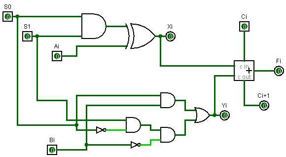
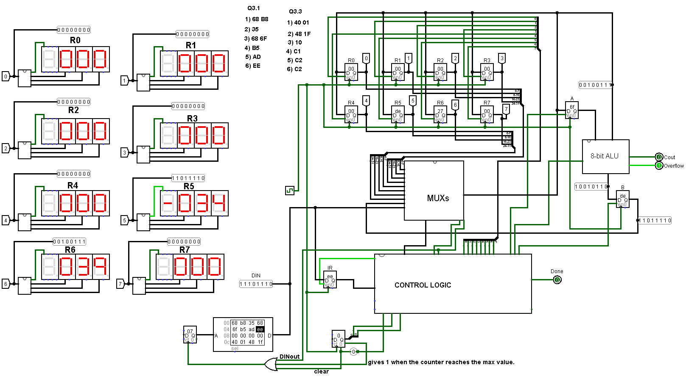

# A Simple Multi-Cycle Central Processing Unit (CPU) Design

## Introduction

This project involves the design of a central processing unit (CPU) capable of moving, loading, and manipulating data. The CPU features 8 registers and an instruction code format represented as `OOXXXYYY`. The first two bits denote operations, while the remaining bits specify operands. For the move immediate operation, the entire code is considered a value in the second clock cycle.

## Data Path of Operations

### Move
1. **First Clock Cycle**: Instruction Register (IR) is loaded with DIN when the IRin signal is high.
2. **Second Clock Cycle**: Ryout flag selects the source register, and Rxin flag enables the destination register to move the data.

### Move Immediate
1. **First Clock Cycle**: IR is loaded with DIN when IRin is high.
2. **Second Clock Cycle**: MUX selects DIN, and Rxin enables the desired register to receive the immediate value.

### Addition and Subtraction
1. **First Clock Cycle**: IR is loaded with DIN when IRin is high.
2. **Second Clock Cycle**: Rx data is loaded into temporary register A.
3. **Third Clock Cycle**: Ry register's data is loaded onto the bus.
4. **Fourth Clock Cycle**: ALU performs addition or subtraction based on the Asen flag, storing the result in register B.
5. **Fifth Clock Cycle**: Rxin enables the destination register to store the result from register B.

## 1-Bit ALU from Previous Labs

The 1-bit ALU designed in previous labs is utilized to create an 8-bit ALU. This ALU is capable of performing addition and subtraction, with complementary operations represented in a truth table.

Figure 2: illustrating 1-bit ALU.

### Truth Table for ALU Control Circuit
- The control circuit uses Boolean expressions derived from the truth table.
- The clock starts in the IR state, and clear signals are added for the first two instructions.
- A 2-bit counter resets at the 4th clock cycle.

### Control Logic Circuit
- **MUX Selection**: Rxout as a select signal in the 2x1 MUX determines which register's data appears on the bus.
- **Enable Signals**: Rxin enables the decoder to decide which register receives data.

### MUX Circuit
- An 8x1 MUX determines the selected register.
- Two 2x1 MUXes select between B and DIN inputs.

## Displays in the Circuit

A custom "decimal" circuit with three ROMs is built to read register contents easily. This circuit decodes 8-bit numbers (from -128 to 127) into corresponding most significant, middle, and least significant bits, with a sign output indicating the number's sign.

## Main Circuit

- **Components**: 2-bit counter, A and B temporary registers, 8 memory registers, and an IR register for storing instructions.
- **ROM for Instructions**: An OR gate manages inputs to facilitate faster instruction loading, synchronized with clock cycles.

## Demonstration and End Results

The CPU design demonstrates the functionality through a series of instructions to show the 1's complement of the value in register Rb in register Ra.

Figure 2: illustrating sub operation the architecture of the CPU.

### Instruction Sequence
1. Load immediate values into registers.
2. Move values between registers.
3. Perform subtraction operations.

The functionality is implemented with 6 instructions:
- 2 move immediate instructions (4 clock cycles)
- 1 move instruction (2 clock cycles)
- 3 subtraction instructions (12 clock cycles)

A total of 18 clock cycles are used to achieve the desired functionality.

## Usage Instructions

To use this CPU design, follow these steps:
1. Load the provided instructions into the ROM.
2. Set the appropriate clock signals to initiate the operations.
3. Monitor the registers and ALU operations as described in the data path.
## Instruction Set

The CPU supports a set of instructions as listed below:

| OP code | Operation and Operands | Executed Function         |
|---------|-------------------------|---------------------------|
| 00      | mv Rx, Ry               | Rx ← [Ry]                 |
| 01      | mvi Rx, D               | Rx ← D                    |
| 10      | add Rx, Ry              | Rx ← [Rx] + [Ry]          |
| 11      | sub Rx, Ry              | Rx ← [Rx] - [Ry]          |
## Contribution

Contributions to this project are welcome. Please fork the repository, make your changes, and submit a pull request. Ensure that your code adheres to the project's coding standards and includes appropriate documentation.

